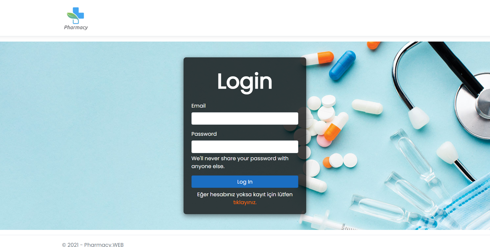
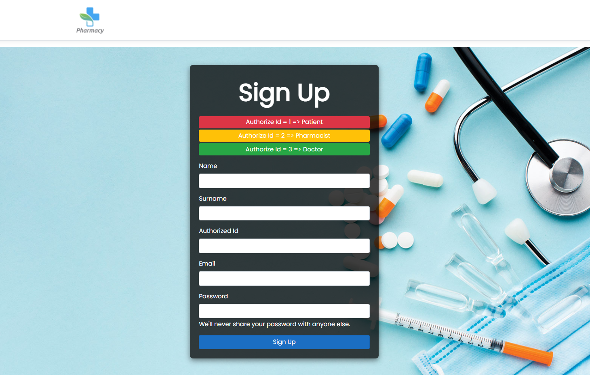
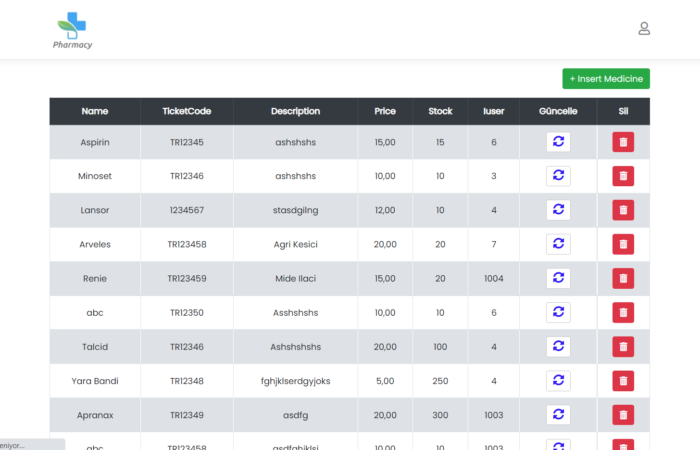
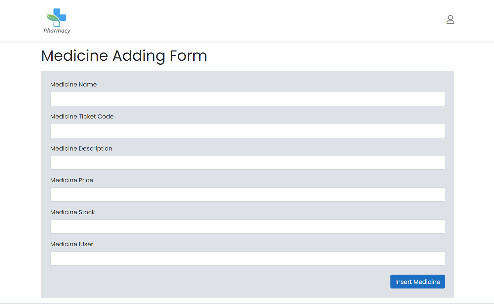
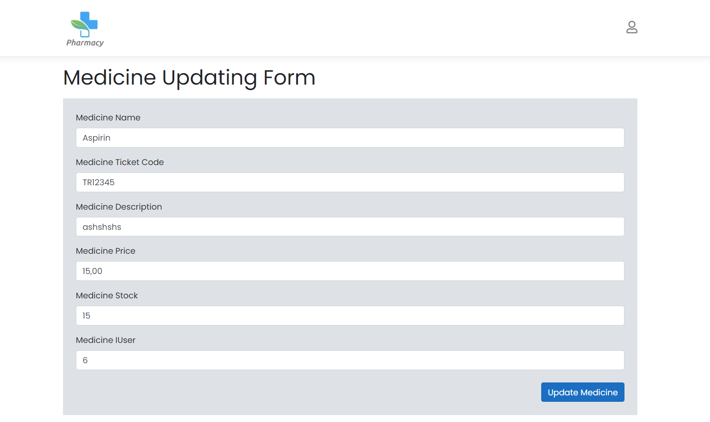
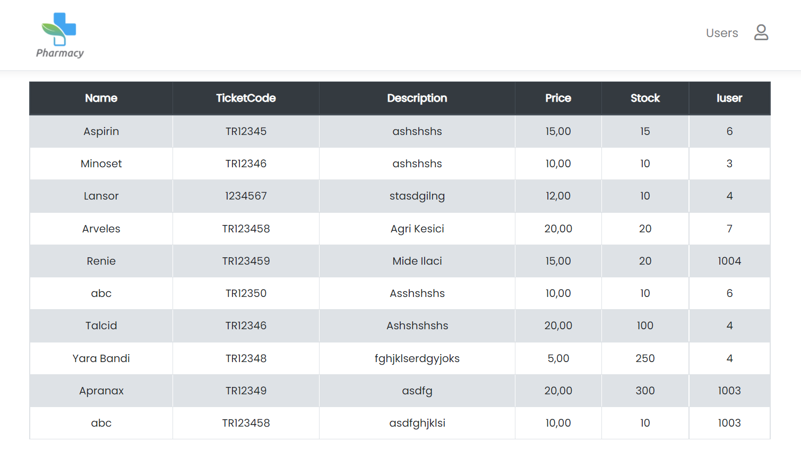
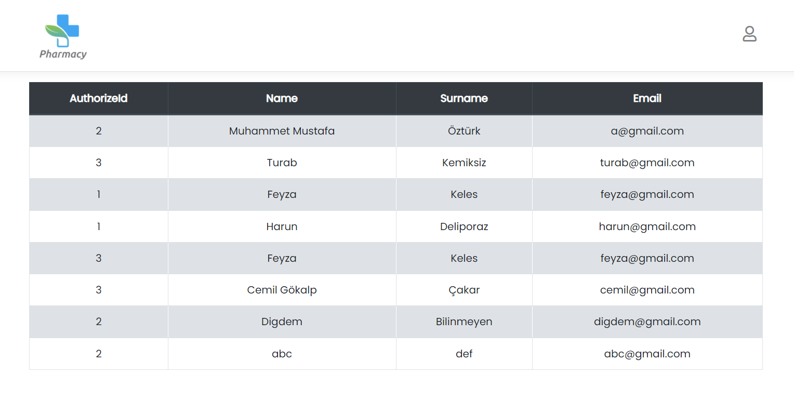
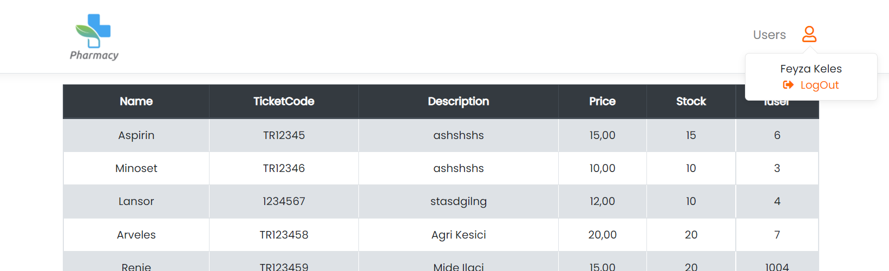

# Pharmacy App

1. Web katmaný eklendi.
2. Redis kurulumu saðlandý ve önceki haftalardaki memCacheler DistributedCache ile deðiþtirildi.
3. Hangfire kuruldu.
4. Web katmanýnda arayüz tasarýmlarý yapýldý.
5. Web katmanýnda cache den veri çekilerek yetki kontrolü saðlandý.
6. Mail gönderimi için service katmanýnda method tanýmlandý ve hangfire ile çalýþtýrýldý.

## Arayüzdan Örnekler

### Login Sayfasý

### SignUp Sayfasý

### Ýlaç Listeleme Sayfasý

### Ýlaç Ekleme Sayfasý

* Giren kullanýcý eczacý ise ilaç ekleme yapabilir.

### Ýlaç Güncelleme Sayfasý

* Giren kullanýcý eczacý ise ilaç güncelleme yapabilir.

### Liste Sayfasýnýn Yetkisiz Eleman Giriþ Yaptýðýnda Görünümü

* Giren kullanýcý eczacý deðilse, güncelleme ve silme butonlarý kaldýrýldý. 
* Giren kullanýcý doktor ise, kullanýcýlarý görüntüleyebileceði alan eklendi.

### Kullanýcý Listeleme Sayfasý

### Kullanýcýnýn Sistemden Çýkýþ Yapabileceði Alan

